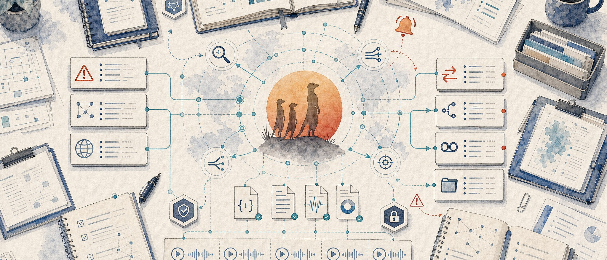

<p align="center">
  
</p>

<h1 align="center">suricata-mcp</h1>

<p align="center">
  <a href="https://www.npmjs.com/package/suricata-mcp"></a>
  <a href="https://github.com/solomonneas/suricata-mcp/actions/workflows/ci.yml"></a>
  <a href="https://www.typescriptlang.org/"></a>
  <a href="https://nodejs.org/"></a>
  <a href="https://modelcontextprotocol.io/"></a>
  <a href="https://suricata.io/"></a>
  <a href="https://zeek.org/"></a>
  <a href="LICENSE"></a>
</p>

An MCP (Model Context Protocol) server for network security monitoring. Provides intelligent analysis of Suricata IDS/IPS and Zeek NSM logs, cross-correlation between sensors, threat intelligence integration (MISP + TheHive), PCAP replay, and advanced analytics including DGA detection, C2 beaconing, data exfiltration, and lateral movement detection.

## Features

- **36 tools** for comprehensive network security analysis
- **5 resources** for quick reference data
- **5 prompts** for guided investigation workflows
- **Suricata EVE JSON** alert querying, flow analysis, protocol inspection, rule management
- **Zeek TSV logs** connection analysis, DNS/HTTP/TLS/SSH/file inspection
- **Cross-correlation** between Suricata alerts and Zeek network metadata
- **Threat intel** integration with MISP IOC lookup and TheHive case/alert creation
- **PCAP management** list and replay PCAPs through Suricata or Zeek
- **Advanced analytics** DGA detection, C2 beaconing, data exfiltration, lateral movement
- **Rule management** create, enable/disable, and reload custom Suricata rules
- Streaming parsers for large files, CIDR-aware filtering, gzip archive support

## Prerequisites

- Node.js 20+
- Suricata sensor producing EVE JSON logs
- (Optional) Zeek NSM with TSV log output
- (Optional) MISP and/or TheHive instances for threat intel

## Installation

```bash
git clone https://github.com/solomonneas/suricata-mcp.git
cd suricata-mcp
npm install
npm run build
```

## Configuration

Set environment variables to point at your NIDS installation:

| Variable | Default | Description |
|----------|---------|-------------|
| `SURICATA_EVE_LOG` | `/var/log/suricata/eve.json` | Path to primary EVE JSON log |
| `SURICATA_EVE_ARCHIVE` | `/var/log/suricata/` | Directory for rotated/archived logs |
| `SURICATA_RULES_DIR` | _(none)_ | Suricata rules directory |
| `SURICATA_MAX_RESULTS` | `1000` | Maximum results per query |
| `SURICATA_UNIX_SOCKET` | _(none)_ | Unix socket path for live commands |
| `ZEEK_LOGS_DIR` | _(none)_ | Zeek log directory (enables Zeek tools) |
| `PCAP_DIR` | _(none)_ | PCAP drop directory (enables PCAP tools) |
| `MISP_URL` | _(none)_ | MISP instance URL |
| `MISP_API_KEY` | _(none)_ | MISP API key |
| `THEHIVE_URL` | _(none)_ | TheHive instance URL |
| `THEHIVE_API_KEY` | _(none)_ | TheHive API key |

## Usage

### Claude Desktop

Add to `~/Library/Application Support/Claude/claude_desktop_config.json` (macOS) or `%APPDATA%\Claude\claude_desktop_config.json` (Windows):

```json
{
  "mcpServers": {
    "suricata": {
      "command": "suricata-mcp",
      "env": {
        "SURICATA_EVE_LOG": "/opt/nids/suricata/logs/eve.json",
        "SURICATA_RULES_DIR": "/opt/nids/suricata/rules",
        "ZEEK_LOGS_DIR": "/opt/nids/zeek/logs",
        "PCAP_DIR": "/opt/nids/pcaps",
        "MISP_URL": "https://misp.local",
        "MISP_API_KEY": "your-key",
        "THEHIVE_URL": "http://thehive.local:9000",
        "THEHIVE_API_KEY": "your-key"
      }
    }
  }
}
```

### Claude Code

```bash
claude mcp add suricata \
  --env SURICATA_EVE_LOG=/opt/nids/suricata/logs/eve.json \
  --env SURICATA_RULES_DIR=/opt/nids/suricata/rules \
  --env ZEEK_LOGS_DIR=/opt/nids/zeek/logs \
  -- suricata-mcp
```

Add `--scope user` to make it available from any directory instead of only the current project.

### OpenClaw

If you're running from a source checkout instead of the npm-installed binary, point `command`/`args` at the built `dist/index.js`:

```bash
openclaw mcp set suricata '{
  "command": "node",
  "args": ["/absolute/path/to/suricata-mcp/dist/index.js"],
  "env": {
    "SURICATA_EVE_LOG": "/opt/nids/suricata/logs/eve.json",
    "SURICATA_RULES_DIR": "/opt/nids/suricata/rules",
    "ZEEK_LOGS_DIR": "/opt/nids/zeek/logs"
  }
}'
```

Or, with the global npm install:

```bash
openclaw mcp set suricata '{
  "command": "suricata-mcp",
  "env": {
    "SURICATA_EVE_LOG": "/opt/nids/suricata/logs/eve.json",
    "SURICATA_RULES_DIR": "/opt/nids/suricata/rules",
    "ZEEK_LOGS_DIR": "/opt/nids/zeek/logs"
  }
}'
```

Then restart the OpenClaw gateway so the new server is picked up:

```bash
systemctl --user restart openclaw-gateway
openclaw mcp list   # confirm "suricata" is registered
```

### Hermes Agent

[Hermes Agent](https://github.com/NousResearch/hermes-agent) reads MCP config from `~/.hermes/config.yaml` under the `mcp_servers` key. Add an entry:

```yaml
mcp_servers:
  suricata:
    command: "suricata-mcp"
    env:
      SURICATA_EVE_LOG: "/opt/nids/suricata/logs/eve.json"
      SURICATA_RULES_DIR: "/opt/nids/suricata/rules"
      ZEEK_LOGS_DIR: "/opt/nids/zeek/logs"
```

Or, when running from a source checkout instead of the global npm install:

```yaml
mcp_servers:
  suricata:
    command: "node"
    args: ["/absolute/path/to/suricata-mcp/dist/index.js"]
    env:
      SURICATA_EVE_LOG: "/opt/nids/suricata/logs/eve.json"
      SURICATA_RULES_DIR: "/opt/nids/suricata/rules"
      ZEEK_LOGS_DIR: "/opt/nids/zeek/logs"
```

Then reload MCP from inside a Hermes session:

```
/reload-mcp
```

### Codex CLI

[Codex CLI](https://github.com/openai/codex) registers MCP servers via `codex mcp add`:

```bash
codex mcp add suricata \
  --env SURICATA_EVE_LOG=/opt/nids/suricata/logs/eve.json \
  --env SURICATA_RULES_DIR=/opt/nids/suricata/rules \
  --env ZEEK_LOGS_DIR=/opt/nids/zeek/logs \
  -- suricata-mcp
```

Or, when running from a source checkout:

```bash
codex mcp add suricata \
  --env SURICATA_EVE_LOG=/opt/nids/suricata/logs/eve.json \
  --env SURICATA_RULES_DIR=/opt/nids/suricata/rules \
  --env ZEEK_LOGS_DIR=/opt/nids/zeek/logs \
  -- node /absolute/path/to/suricata-mcp/dist/index.js
```

Codex writes the entry to `~/.codex/config.toml` under `[mcp_servers.suricata]`. Verify with:

```bash
codex mcp list
```

### Standalone

```bash
SURICATA_EVE_LOG=/var/log/suricata/eve.json \
ZEEK_LOGS_DIR=/opt/zeek/logs \
node dist/index.js
```

### Development

```bash
npm run dev          # Watch mode with tsx
npm run build        # Production build
npm test             # Run test suite (158 tests)
npm run lint         # Type-check
```

## Tools

### Suricata Alert Analysis (4 tools)

| Tool | Description |
|------|-------------|
| `suricata_query_alerts` | Search alerts by SID, signature, category, severity, IP, port, protocol, action, time range |
| `suricata_alert_summary` | Aggregated alert statistics grouped by signature, category, severity, source, or destination |
| `suricata_top_alerts` | Top alerts by frequency and severity with unique source/destination counts |
| `suricata_alert_timeline` | Time-bucketed alert counts with severity breakdown |

### Suricata Flow Analysis (2 tools)

| Tool | Description |
|------|-------------|
| `suricata_query_flows` | Search flows by IP, port, protocol, app protocol, bytes, duration, state |
| `suricata_flow_summary` | Top talkers, protocol distribution, bandwidth stats |

### Suricata Protocol Analysis (6 tools)

| Tool | Description |
|------|-------------|
| `suricata_query_dns` | Search DNS queries by name, source IP, record type, response code |
| `suricata_query_http` | Search HTTP transactions by hostname, URL, method, status, user-agent |
| `suricata_query_tls` | Search TLS connections by SNI, JA3/JA4, certificate subject/issuer |
| `suricata_query_ssh` | Search SSH connections by client/server software version |
| `suricata_query_fileinfo` | Search extracted files by name, magic type, hash, size |
| `suricata_query_anomalies` | Search protocol anomalies by type, source/destination IP |

### Suricata Rule Management (5 tools)

| Tool | Description |
|------|-------------|
| `suricata_search_rules` | Search rule files by SID, message, classtype, reference, content |
| `suricata_rule_stats` | Rule set statistics: total, enabled/disabled, by action, by classtype |
| `suricata_create_rule` | Write a custom rule to local.rules |
| `suricata_toggle_rule` | Enable or disable a rule by SID |
| `suricata_reload_rules_docker` | Reload rules via Docker (suricata-update + SIGUSR2) |

### Suricata Engine & Live Commands (3 tools)

| Tool | Description |
|------|-------------|
| `suricata_engine_stats` | Capture, decoder, detect, and flow statistics |
| `suricata_reload_rules` | Live rule reload via Unix socket |
| `suricata_iface_stat` | Interface capture statistics via Unix socket |

### Suricata Investigation (2 tools)

| Tool | Description |
|------|-------------|
| `suricata_investigate_host` | Full host investigation across all event types |
| `suricata_investigate_alert` | Deep alert investigation with correlated flow and protocol data |

### Advanced Analytics (4 tools)

| Tool | Description |
|------|-------------|
| `suricata_beaconing_detection` | Detect C2 beaconing via connection interval analysis with jitter and confidence scoring |
| `suricata_dga_detection` | Detect DGA domains using Shannon entropy analysis on DNS queries |
| `suricata_exfiltration_detection` | Detect hosts with abnormally high outbound data transfer |
| `suricata_lateral_movement_detection` | Detect internal-to-internal scanning on unusual ports |

### Zeek NSM Analysis (8 tools)

| Tool | Description |
|------|-------------|
| `zeek_query_connections` | Search conn.log by IP, port, protocol, service, duration, bytes, state |
| `zeek_query_dns` | Search dns.log by query name, type, rcode |
| `zeek_query_http` | Search http.log by host, URI, method, status, user-agent |
| `zeek_query_ssl` | Search ssl.log by server name, TLS version |
| `zeek_query_files` | Search files.log by filename, MIME type, hash |
| `zeek_query_ssh` | Search ssh.log by client, server, auth success |
| `zeek_query_weird` | Search weird.log for protocol anomalies |
| `zeek_connection_summary` | Top talkers, protocol and service distribution, bandwidth stats |

### Cross-Correlation (1 tool)

| Tool | Description |
|------|-------------|
| `correlate_alert_with_zeek` | Cross-correlate Suricata alerts with Zeek conn/dns/http/ssl logs by IP pair and time window |

### PCAP Management (3 tools)

| Tool | Description |
|------|-------------|
| `pcap_list` | List available PCAP files |
| `pcap_replay_suricata` | Replay a PCAP through Suricata |
| `pcap_replay_zeek` | Replay a PCAP through Zeek |

### Threat Intelligence (3 tools)

| Tool | Description |
|------|-------------|
| `misp_search_ioc` | Search MISP for IOCs (IP, domain, hash) |
| `thehive_create_case` | Create a TheHive case from investigation findings |
| `thehive_create_alert` | Push a Suricata alert to TheHive for triage |

## Resources

| URI | Description |
|-----|-------------|
| `suricata://event-types` | All EVE event types with field descriptions |
| `suricata://stats/current` | Latest engine performance statistics |
| `suricata://rules/summary` | Rule set summary |
| `suricata://config` | Current server configuration (sanitized) |
| `zeek://log-types` | Available Zeek log types with field descriptions |

## Prompts

| Prompt | Description |
|--------|-------------|
| `investigate-alert` | Guided alert investigation workflow |
| `hunt-for-threats` | Proactive threat hunting methodology |
| `incident-response` | Full IR workflow with Suricata + Zeek + TheHive |
| `network-baseline` | Network baseline report generation |
| `daily-alert-report` | Daily alert summary report template |

## Architecture

```
suricata-mcp/
  src/
    index.ts              # MCP server entry, tool registration
    config.ts             # Environment config (Suricata, Zeek, PCAP, MISP, TheHive)
    types.ts              # EVE JSON type definitions
    parser/
      eve.ts              # Streaming EVE JSON parser (supports .gz)
      rules.ts            # Suricata rule file parser
      zeek.ts             # Zeek TSV log parser with header handling
    query/
      engine.ts           # Query engine for EVE files
      filters.ts          # CIDR, wildcard, time range, IP matching
      aggregation.ts      # Statistical aggregation, top-N, numeric stats
      timeline.ts         # Time-bucketed event aggregation
    tools/
      alerts.ts           # Suricata alert analysis
      flows.ts            # Suricata flow analysis
      dns.ts              # Suricata DNS tools
      http.ts             # Suricata HTTP tools
      tls.ts              # Suricata TLS/JA3/JA4 tools
      files.ts            # Suricata file extraction tools
      ssh.ts              # Suricata SSH tools
      anomalies.ts        # Suricata anomaly tools
      rules.ts            # Rule management (search, stats, create, toggle, reload)
      stats.ts            # Engine stats tools
      investigation.ts    # Cross-type investigation
      zeek.ts             # Zeek log query tools (conn, dns, http, ssl, files, ssh, weird)
      pcap.ts             # PCAP list and replay tools
      threatintel.ts      # MISP search + TheHive case/alert creation
      correlation.ts      # Suricata-Zeek cross-correlation
    analytics/
      beaconing.ts        # C2 beacon detection
      dns_entropy.ts      # DGA detection via Shannon entropy
      exfiltration.ts     # Data exfiltration detection
      lateral.ts          # Lateral movement detection + RFC1918 helpers
      ja3.ts              # Known JA3 fingerprint database
    socket/
      client.ts           # Unix socket for live Suricata commands
    resources.ts          # MCP resources
    prompts.ts            # MCP prompts
  tests/
    parser.test.ts        # Parser unit tests
    query.test.ts         # Filter and aggregation tests
    tools.test.ts         # Tool handler integration tests
    zeek.test.ts          # Zeek parser and tool tests
    analytics.test.ts     # Advanced analytics tests
    correlation.test.ts   # Cross-correlation tests
  test-data/
    eve.json              # Sample Suricata EVE JSON data
    sample.rules          # Sample Suricata rules
    conn.log              # Sample Zeek conn.log
    dns.log               # Sample Zeek dns.log
    http.log              # Sample Zeek http.log
    ssl.log               # Sample Zeek ssl.log
    files.log             # Sample Zeek files.log
    ssh.log               # Sample Zeek ssh.log
    weird.log             # Sample Zeek weird.log
  scripts/
    generate-eve.ts       # Mock EVE data generator
```

## Testing

```bash
npm test             # Run all 158 tests
npm run test:watch   # Watch mode
```

## License

MIT
